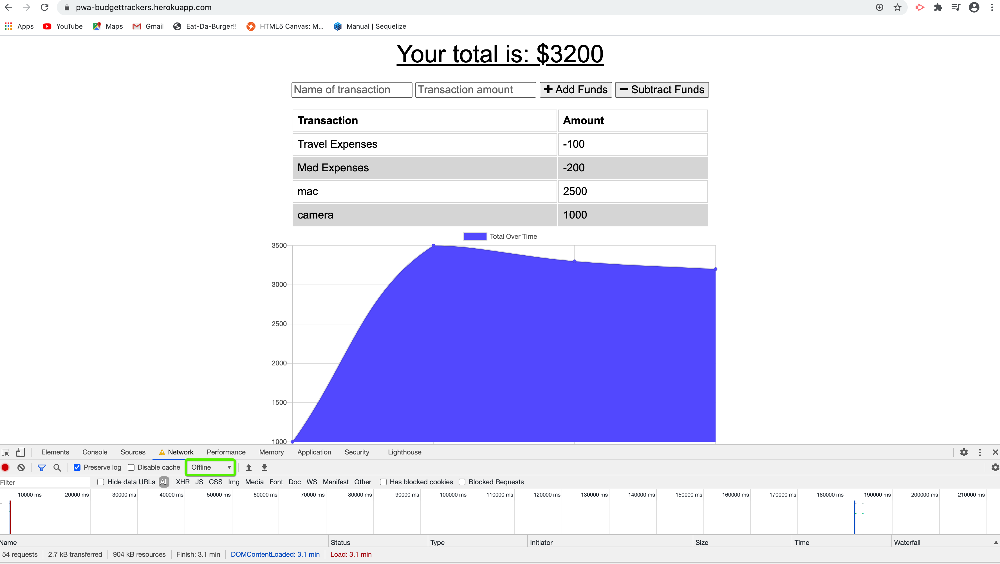
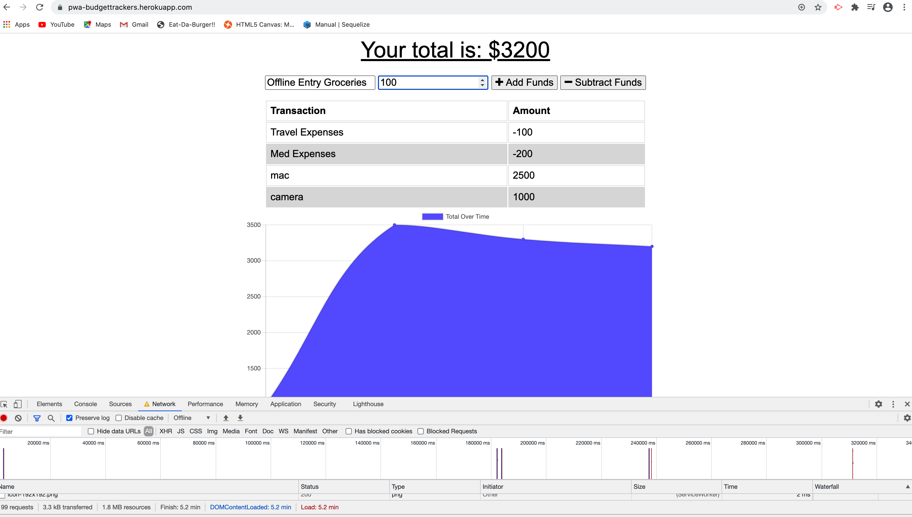
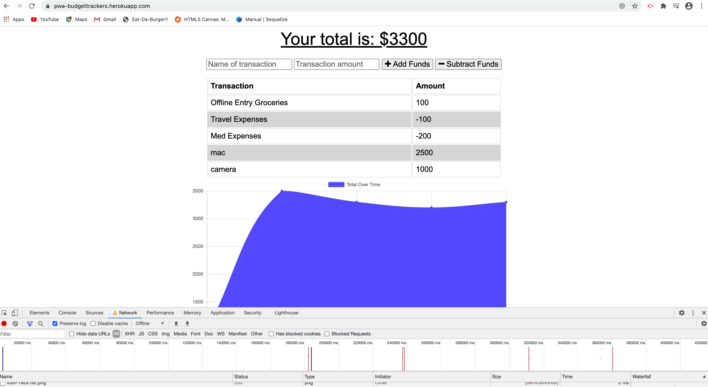
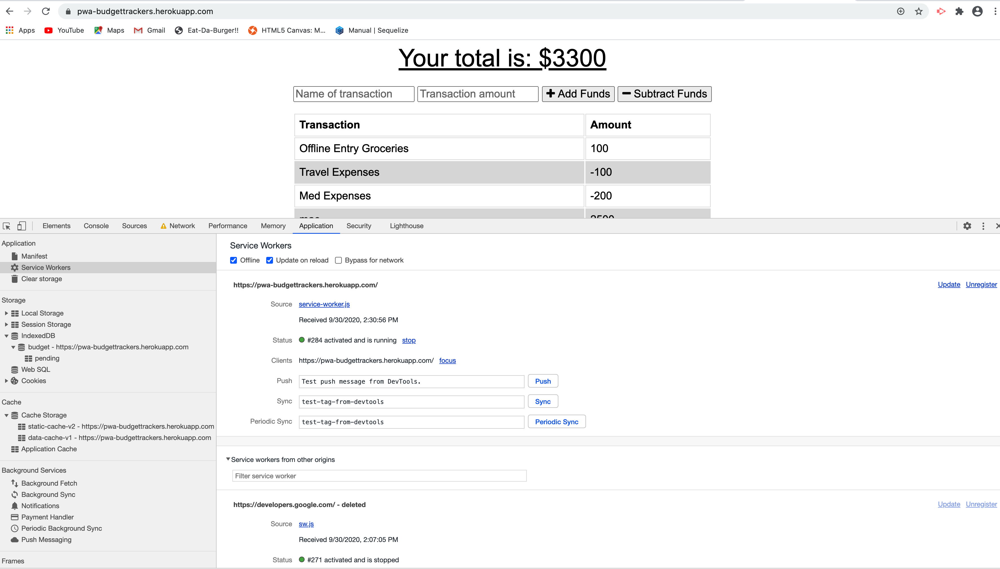

## PWA : Online/Offline Budget Trackers

The functionality of Budget Tracker application is to allow for offline access, cache the files and also perform deposits/expenses even in offline mode.

The user will be able to add expenses and deposits to their budget with or without a connection. When entering transactions offline, they should populate the total when brought back online.

Offline Functionality:

  * Enter deposits offline

  * Enter expenses offline

When brought back online:

  * Offline entries should be added to tracker.

## User Story
AS AN avid traveller
I WANT to be able to track my withdrawals and deposits with or without a data/internet connection
SO THAT my account balance is accurate when I am traveling

## Business Context

Giving users a fast and easy way to track their money is important, but allowing them to access that information anytime is even more important. Having offline functionality is paramount to our applications success.

## File Description

* manifest.webmanifest - The webmanifest is a JSON file that tells the browser about your Progressive Web App and how it should behave when installed on the user's desktop or mobile device. A typical manifest file includes the app name, the icons the app should use, and the URL that should be opened when the app is launched.

* service-worker.js - PWAs utilize the Service Worker and Cache APIs to cache assets and API responses to ensure applications work without an internet connection.

* db.js - In offline mode, save the data to indexedDB and the data will be there. 
After getting network access or in online mode, the data will be saved to our mongodb. The main purpose of this is to access the application both offline/online.

### Screenshots

Here's the link to my developed Website : [Budget Tracker](https://pwa-budgettrackers.herokuapp.com/)

#### References

Stack Overflow : [Stackoverflow - cache when offline](https://stackoverflow.com/questions/33045517/use-serviceworker-cache-only-when-offline) 
Article : [Article - Heroku App Crashed Error](https://dev.to/lawrence_eagles/causes-of-heroku-h10-app-crashed-error-and-how-to-solve-them-3jnl) 
Video   : [Youtube video - Service worker, Caching ](https://www.youtube.com/watch?v=ksXwaWHCW6k)